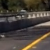
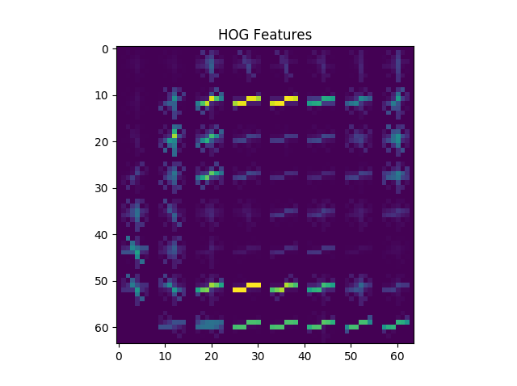
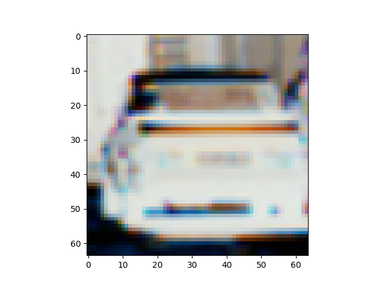
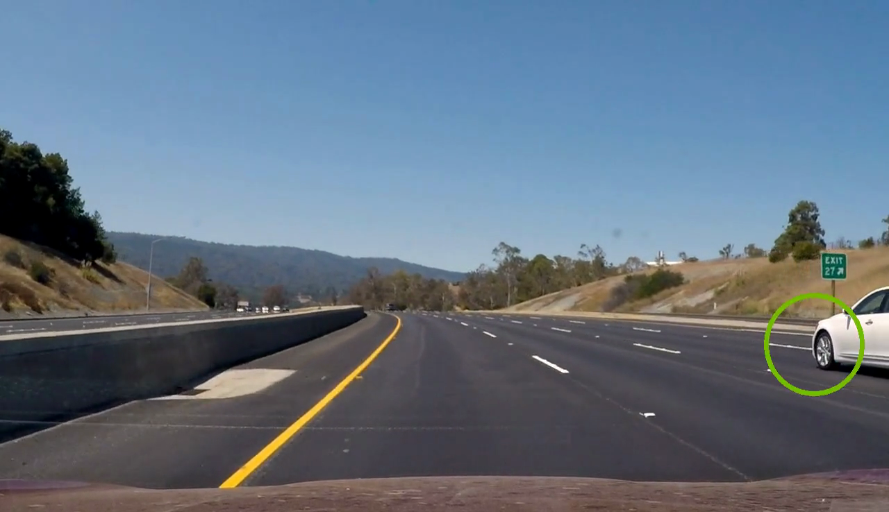

# **Vehicle Detection** 
### Self-Driving Car Engineer Nanodegree - _Project 5_
### By: **Soroush Arghavan**

---

**Vehicle Detection Project**

The goals / steps of this project are the following:

* Perform a Histogram of Oriented Gradients (HOG) feature extraction on a labeled training set of images and train a classifier Linear SVM classifier
* Implement a sliding-window technique and use  trained classifier to search for vehicles in images.
* Run pipeline on a video stream and create a heat map of recurring detections frame by frame to reject outliers and follow detected vehicles.
* Estimate a bounding box for vehicles detected.

## [Rubric](https://review.udacity.com/#!/rubrics/513/view) Points

### Here I will consider the rubric points individually and describe how I addressed each point in my implementation.  

---

### Histogram of Oriented Gradients (HOG)

#### 1. Explain how (and identify where in your code) you extracted HOG features from the training images.

This process can be found in the 'extract_features' function of the 'helpers.py'. The function is used in lines 100 to 130 of 'pipeline.py'.  

I started by reading in all the `vehicle` and `non-vehicle` images. I then take 7000 samples of each for training the classifier. This number was chosen carefully to avoid running out of memory on my personal laptop while loading the samples. Here is an example of one of each of the `vehicle` and `non-vehicle` classes:

Here is an example HOG features of a vehicle sample:

#### 2. Explain how you settled on your final choice of HOG parameters.

I tried various combinations of parameters. I found RGB to be the most effective for identifying vehicles. I used all three channels for feature extraction. 

For extraction of HOG features, I used the values 'orientation=9', 'pix_per_cell=8' and 'cell_per_block=2' by default and did not feel the need to experiment with them.

#### 3. Describe how (and identify where in your code) you trained a classifier using your selected HOG features (and color features if you used them).

I trained a linear SVM using the color, spatial and HOG features. I used (32, 32) spatial binning as additional features. First, the features are stacked in a single array and then scaled using a 'StandardScaler'. The features and labels are then shuffled and split into training and test samples. 20 percent of samples were used as test samples.

Below is an example of a sample image and the different features plotted.

### Sliding Window Search

#### 1. Describe how (and identify where in your code) you implemented a sliding window search.  How did you decide what scales to search and how much to overlap windows?

I implemented three sliding windows searches in order to take samples to run through the classifier. The code for these windows can be found in 'process_frame' function of 'pipeline'. For all of the windows, an overlap ratio of 0.8 was chosen in both directions.

The first set of windows are 96 x 96 and move from y=380 to y=550. These windows are the smallest and looking for further vehicles. 

The second set are 1.25 times larger and move from y=400 to y=600.

Finally the biggest windows are 2 times larger than the smallest ones and moving from y=400 to the bottom of the frame.

The resulting bounding boxes from each set of windows are then added to a heatmap. Below is the heatmap corresponding to each sliding window search on a single frame.

Small Window Search:

Medium Window Search:

Large Window Search:

The sizes of the windows were chosen relative to the size of the cars in the image due to perspective. The limits for each window were also carefully adjusted. There is some overlap between different window sizes which is intentional. This ensures that the vehicles are indentified in multiple samples and enhances the heatmap. This eventually helps reduce the chance of false positives.

#### 2. Show some examples of test images to demonstrate how your pipeline is working.  What did you do to optimize the performance of your classifier?

Ultimately, I searched on two scales using RGB 3-channel HOG features plus spatially binned color and histograms of color in the feature vector, which provided a nice result.  Here I will demonstrate and discuss some of the interesting results.

Here we can see that the vehicles are identified as soon as they enter the frame, even if the vehicle is not completely in the frame. This shows the robustness of the model to predict presence of a car based on partial samples.

We can also see that even with an averaging algorithm in place, the model is surprisingly able to detect cars from the other side of the highway.

Another interesting fact is that the labeling that is performed on the heatmap and the averaging cause the two cars in proximity of each other to be identified as one object. This might or might not cause an issue for controlling the car depending on if the number of cars in the frame is significant.

### Video Implementation

#### 1. Provide a link to your final video output.  Your pipeline should perform reasonably well on the entire project video (somewhat wobbly or unstable bounding boxes are ok as long as you are identifying the vehicles most of the time with minimal false positives.)
Here's a [link to my video result](./output.mp4)

#### 2. Describe how (and identify where in your code) you implemented some kind of filter for false positives and some method for combining overlapping bounding boxes.

I recorded the positions of positive detections in each frame of the video. Over 5 frames, the heatmaps are accumulated to enhance detection of false positives and increase label stability. From the positive detections I created a heatmap and then thresholded that map to identify vehicle positions. I then used `scipy.ndimage.measurements.label()` to identify individual blobs in the heatmap. I then assumed each blob corresponded to a vehicle. For each blob a center and a radius is calculated. I drew circles using 'cv2.circle()' to cover the area of each blob detected. The radius of the blob can be thought of as the size (or proximity) of the object. The color of the circle is proportional to the radius of the blob, ranging from green (far) to red (close).

In order to further improve false positive rejection and stabalize the final bounding boxes, the heatmaps are accumulated for five consecutive frames. The heatmap is then filtered with a heat threshhold of 12 and then labeled and drawn onto the final image.

The figures below display the heatmap after 1, 2, 3, 4 and 5 frames respectively.

---

### Discussion

#### 1. Briefly discuss any problems / issues you faced in your implementation of this project.  Where will your pipeline likely fail?  What could you do to make it more robust?

* The model is capable of recognizing even high speed passing vehicles on the opposing lane. Some filtering might be needed to fix the issue.
* The pipeline is extremely slow and definitely not fit for realtime analysis. One idea to improve the pipeline would be to start sliding windows around the windows from the last frame to avoid the need to search the whole frame.
* RGB is not an ideal feature to base the model on. I did experiment with other color spaces and HOG channels but RGB proved to be the most successful. More experiment is needed to find a better colorspace.

